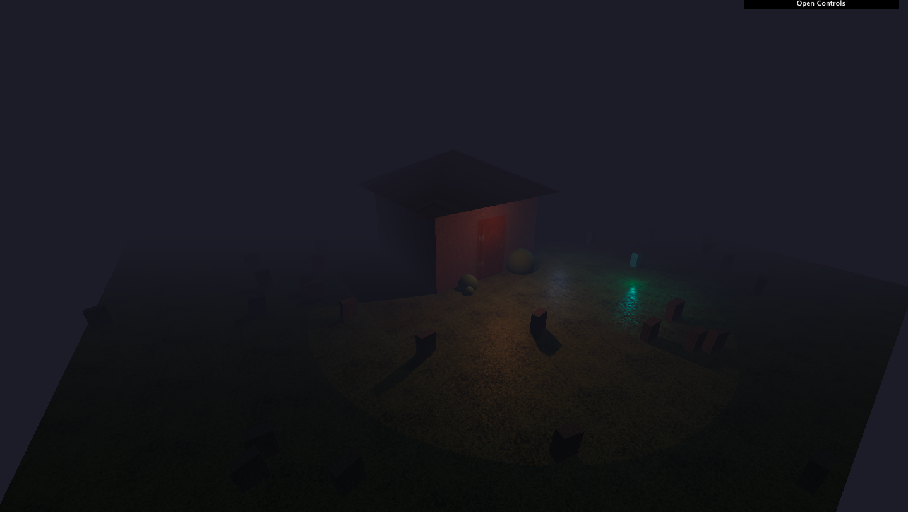

# Haunted House

## Introduction
House House is small project made during my journey to learn Threejs. A powerful Javascript library to create 3D experiences for the web.

This scene involves a House along with some graves and lights that are travelling around the house to provide spooky feel to the environment.

## Setup
To experience this live on your device. Downlaod Node.js and run the following commands-

* Install dependencies (only the first time)

    *npm install*

* Run the local server at localhost:8080
    
    *npm run dev*

## Concepts Used
A scene is created which is responsive and occupies the whole screen real estate. Perspective camera is setup along with the Orbital controls.

Geometries such as House, Bushes, Floor, Graves are created from scratch and complex textures are added to them.

Fog is added to the scene along with dim Ambient Lightening to reduce the visibility and create a spooky environment.

Additional lightning in the form of Point Light is added to the House and Similar point lights are used to simulate ghosts.

Real time Shadows are casted to make the environment look realistic and the ghost lights are animated to move in a random manner aroud the house.

This completes the whole scene with moving lights and advanced shadows and textures which react to the lightning in real-time and makes the scene feel alive.

## Results
Here are a few screenshots of the final web scene that was created.

